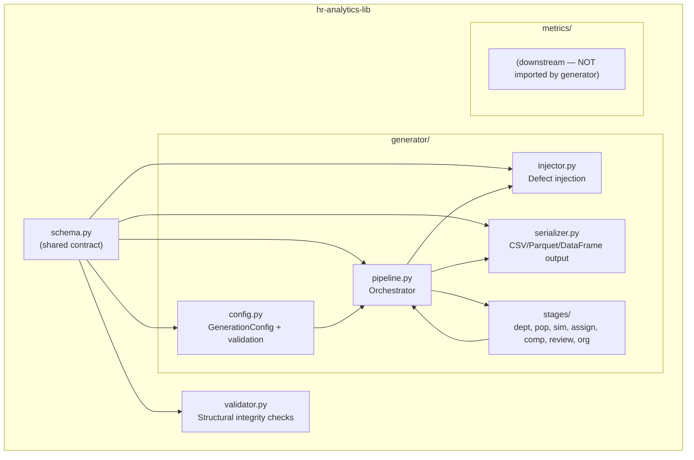
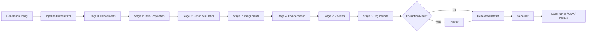

# Technical Design — Synthetic HR Data Generator

## Provisional Resolution Dependencies

| ID | Resolution | Change Impact |
|----|-----------|---------------|
| [P1] | Auto-generated department names (`DEPT_001`, …) | Low — affects only `_generate_departments()` naming logic |
| [P2] | Max 10,000 employees; < 30s single-core | Medium — no streaming needed but informs batch-size choices |
| [P3] | Transfers are cross-department only | Low — simplifies `TRANSFER` event generation; no level-change on transfer |
| [P4] | Semi-annual reviews (one per 6-month window) | Low — fixed review cadence simplifies period iteration |
| [P5] | Single-currency USD | Low — `currency` column is constant; no FX logic |
| [P6] | No streaming; full materialisation | Low — Serializer writes complete DataFrames |
| [P7] | `pandas.Timestamp` for date math; full calendar months | Low — standard library approach |
| [P8] | Closed defect taxonomy (5 types) | Low — Injector uses fixed enum |
| [P9] | Python 3.12+ | Low — enables modern type syntax (`type` statement, `|` unions) |
| [P10] | `schema.py` is declarations only | Low — Validator owns all checking logic |

---

## Architecture

### Component Decomposition



### Data Flow



---

## schema.py Contract

The shared `schema.py` module defines the authoritative schema. It exports:

- `SCHEMA_VERSION: str` — current schema version (e.g., `"1.0.0"`)
- `DEFECT_TAXONOMY_VERSION: str` — current defect taxonomy version (e.g., `"1.0.0"`)
- `DefectType` enum — the 5 defect types
- `TableSchema` dataclass — per-table column definitions
- `TABLES: dict[str, TableSchema]` — complete schema registry

### Table Definitions

#### `departments`
| Column | Dtype | Nullable | Sort Key |
|--------|-------|----------|----------|
| `department_id` | `str` | No | PK, sort position 0 |
| `department_name` | `str` | No | — |
| `created_date` | `date` | No | — |

#### `employees`
| Column | Dtype | Nullable | Sort Key |
|--------|-------|----------|----------|
| `employee_id` | `str` | No | PK, sort position 0 |
| `hire_date` | `date` | No | sort position 1 |
| `separation_date` | `date` | Yes | — |
| `separation_type` | `str` | Yes | — |
| `level` | `int64` | No | — |
| `department_id` | `str` | No | FK→departments |

#### `employment_events`
| Column | Dtype | Nullable | Sort Key |
|--------|-------|----------|----------|
| `event_id` | `str` | No | PK |
| `employee_id` | `str` | No | FK→employees, sort position 0 |
| `event_date` | `date` | No | sort position 1 |
| `event_type` | `str` | No | — |
| `from_department_id` | `str` | Yes | — |
| `to_department_id` | `str` | Yes | — |
| `from_level` | `int64` | Yes | — |
| `to_level` | `int64` | Yes | — |

#### `assignments`
| Column | Dtype | Nullable | Sort Key |
|--------|-------|----------|----------|
| `assignment_id` | `str` | No | PK |
| `employee_id` | `str` | No | FK→employees, sort position 0 |
| `department_id` | `str` | No | FK→departments |
| `level` | `int64` | No | — |
| `start_date` | `date` | No | sort position 1 |
| `end_date` | `date` | Yes | — |

#### `compensation`
| Column | Dtype | Nullable | Sort Key |
|--------|-------|----------|----------|
| `compensation_id` | `str` | No | PK |
| `employee_id` | `str` | No | FK→employees, sort position 0 |
| `effective_date` | `date` | No | sort position 1 |
| `annual_salary` | `float64` | No | — |
| `currency` | `str` | No | — |

#### `performance_reviews`
| Column | Dtype | Nullable | Sort Key |
|--------|-------|----------|----------|
| `review_id` | `str` | No | PK |
| `employee_id` | `str` | No | FK→employees, sort position 0 |
| `review_date` | `date` | No | sort position 1 |
| `review_period_start` | `date` | No | — |
| `review_period_end` | `date` | No | — |
| `rating` | `int64` | No | — |
| `reviewer_employee_id` | `str` | Yes | FK→employees |

#### `org_periods`
| Column | Dtype | Nullable | Sort Key |
|--------|-------|----------|----------|
| `period` | `str` | No | sort position 0 |
| `grain_type` | `str` | No | sort position 1 |
| `grain_key` | `str` | No | sort position 2 |
| `opening` | `int64` | No | — |
| `hires` | `int64` | No | — |
| `separations` | `int64` | No | — |
| `transfers_in` | `int64` | No | — |
| `transfers_out` | `int64` | No | — |
| `closing` | `int64` | No | — |
| `total_labor_cost` | `float64` | No | — |

#### `defect_manifest`
| Column | Dtype | Nullable | Sort Key |
|--------|-------|----------|----------|
| `table` | `str` | No | sort position 0 |
| `row_index` | `int64` | No | sort position 1 |
| `column` | `str` | No | sort position 2 |
| `defect_type` | `str` | No | — |
| `original_value` | `str` | No | — |
| `mutated_value` | `str` | No | — |

---

## Determinism Design

### Seed Management

```python
from numpy.random import SeedSequence, default_rng

def _create_generators(resolved_seed: int) -> dict[str, numpy.random.Generator]:
    """Spawn 8 independent streams from a single resolved seed."""
    ss = SeedSequence(resolved_seed)
    children = ss.spawn(8)
    stream_names = [
        "departments", "employees", "events",
        "assignments", "compensation", "reviews",
        "org_periods", "injector"
    ]
    return {name: default_rng(child) for name, child in zip(stream_names, children)}
```

**Key guarantees:**
1. Each stage draws from its own child generator — adding/removing a stage cannot affect others.
2. Within each stage, all sampling operations use the assigned stream in a deterministic, fixed-positional order.
3. All intermediate collections (employee lists, department lists) are sorted before sampling to eliminate dictionary-ordering non-determinism.
4. The `injector` stream is position 7 — injection order is fixed regardless of eligible population size.

### Resolved Seed Flow

```
User seed (optional int)
    │
    ├─ Provided → Resolved_Seed = user_seed
    │
    └─ Not provided → Resolved_Seed = SeedSequence().entropy (OS random)
                       └─ recorded in Run_Metadata for reproducibility
```

---

## Canonical_Form Specification

The Canonical Form defines deterministic CSV serialization ensuring byte-identical output:

| # | Rule | Detail |
|---|------|--------|
| 1 | Column order | Matches `schema.py` declaration order per table |
| 2 | Row order | Sorted by designated sort key (composite keys: left-to-right) |
| 3 | Date format | `YYYY-MM-DD` (ISO-8601, no time component) |
| 4 | Float precision | 2 decimal places for monetary; full precision for others |
| 5 | NULL representation | Empty string (no `NA`, `None`, `NaN` literals) |
| 6 | String quoting | RFC 4180 — quote only when field contains comma, newline, or quote |
| 7 | Encoding | UTF-8, no BOM |
| 8 | Line endings | `\n` (Unix LF) |
| 9 | Header | Always present as first row |
| 10 | Trailing newline | File ends with a single `\n` after last data row |

---

## Generation Pipeline

### Stage 0: Departments

- Input: `n_departments`, `start_date`, departments-RNG
- Output: `departments` DataFrame
- Logic: Generate `DEPT_001` through `DEPT_{n_departments:03d}`, assign `created_date` = `start_date`
- Determinism: Department names are formulaic; only `created_date` jitter (if any) uses RNG

### Stage 1: Initial Population

- Input: `headcount`, `n_levels`, departments, `start_date`, employees-RNG
- Output: `employees` DataFrame (initial state — all active, no separations yet)
- Logic:
  - Generate `headcount` employees with `hire_date` = `start_date`
  - Distribute across departments (uniform ± RNG jitter)
  - Distribute across levels (pyramid: more at lower levels)
  - Assign UUIDs as `employee_id`

### Stage 2: Period Simulation

- Input: `employees`, config rates, events-RNG, date range
- Output: `employment_events` DataFrame
- Logic: For each Period in [start_date, end_date]:
  1. Apply monthly separation probability (`annual_separation_rate / 12`) to active employees
  2. Split separations into VOLUNTARY/INVOLUNTARY per configured ratio
  3. Generate HIRE events to maintain growth (`annual_hiring_rate / 12 × current_headcount`)
  4. Generate TRANSFER events (random cross-department moves, ~2% annual rate)
  5. Generate PROMOTION events (random level-ups, ~5% annual rate for eligible)
  - Constraints: At least 1 separation per period if ≥ 10 active; ensure analytical adequacy (Req 6)

### Stage 3: Assignments

- Input: `employees`, `employment_events`, assignments-RNG
- Output: `assignments` DataFrame
- Logic:
  - For each employee, construct gap-free assignment chain from hire to separation (or open-ended)
  - Break assignments at TRANSFER and PROMOTION event boundaries
  - Ensure `start_date` of first assignment = `hire_date`
  - Ensure `end_date` of last assignment = `separation_date` or NULL

### Stage 4: Compensation

- Input: `employees`, `employment_events`, `assignments`, compensation-RNG
- Output: `compensation` DataFrame
- Logic:
  - Initial salary at hire: base = `level × 20_000 + department_offset + noise`
  - New record at each PROMOTION (salary bump 10–20%)
  - Annual merit increase (2–5%) at anniversary
  - Ensure monotonic ordering: higher level → higher median salary per department
  - Round to 2 decimal places

### Stage 5: Performance Reviews

- Input: `employees`, date range, reviews-RNG
- Output: `performance_reviews` DataFrame
- Logic:
  - Semi-annual reviews: one per employee per 6-month window
  - Rating distribution: approximate normal centered at 3 (1–5 scale), no single rating > 50%
  - `reviewer_employee_id`: random active employee at higher level (nullable if no higher level exists)
  - Only active employees receive reviews

### Stage 6: Org Periods

- Input: all prior tables, org_periods-RNG
- Output: `org_periods` DataFrame
- Logic:
  - For each Period × grain (ORG, DEPARTMENT, LEVEL):
    - Count opening (= prior period closing, or initial headcount for first period)
    - Count hires, separations, transfers_in, transfers_out from events
    - Compute closing via Flow Identity
    - Compute `total_labor_cost` = sum(active employee salary / 12)
  - Verify period-chain continuity and cross-grain consistency

### Orchestrator (`pipeline.py`)

```python
def generate(config: GenerationConfig) -> GeneratedDataset:
    resolved_seed = config.seed or SeedSequence().entropy
    rngs = _create_generators(resolved_seed)
    
    departments = stage_departments(config, rngs["departments"])
    employees = stage_initial_population(config, departments, rngs["employees"])
    events = stage_period_simulation(config, employees, rngs["events"])
    assignments = stage_assignments(employees, events, rngs["assignments"])
    compensation = stage_compensation(employees, events, assignments, rngs["compensation"])
    reviews = stage_reviews(employees, config, rngs["reviews"])
    org_periods = stage_org_periods(employees, events, compensation, config, rngs["org_periods"])
    
    dataset = GeneratedDataset(
        tables={...},
        defect_manifest=empty_manifest(),
        metadata=build_metadata(resolved_seed, config, tables)
    )
    
    if config.corruption_config:
        dataset = inject_defects(dataset, config.corruption_config, rngs["injector"])
    
    return dataset
```

---

## Injector Design

### Eligible Populations

| Defect_Type | Eligible Population | Target Tables |
|------------|-------------------|---------------|
| `NULL_INJECTION` | All rows × non-PK non-nullable columns | All 7 tables |
| `DUPLICATE_KEY` | All rows × PK columns (need ≥ 2 rows) | All 7 tables |
| `ORPHAN_FK` | All rows × FK columns | employees, employment_events, assignments, compensation, performance_reviews |
| `DATE_CONTRADICTION` | Rows with (start, end) date pairs where start < end | assignments, performance_reviews |
| `VALUE_OUT_OF_RANGE` | Rows × numeric bounded columns (level, rating, salary) | employees, compensation, performance_reviews |

### Injection Algorithm

```python
def inject_defects(dataset, corruption_config, rng):
    manifest_rows = []
    
    for defect_type in FIXED_ORDER:  # deterministic order
        if defect_type not in corruption_config:
            continue
        
        rate = corruption_config[defect_type]
        eligible = compute_eligible_population(dataset, defect_type)
        
        if len(eligible) == 0:
            continue  # skip, record 0
        
        count = max(1, round(rate * len(eligible)))  # min-1 guarantee
        
        selected = sample_with_skip_reselect(eligible, count, rng, defect_type)
        
        for target in selected:
            original, mutated = apply_mutation(dataset, target, defect_type, rng)
            manifest_rows.append(ManifestEntry(
                table=target.table, row_index=target.row_index,
                column=target.column, defect_type=defect_type.value,
                original_value=str(original), mutated_value=str(mutated)
            ))
    
    dataset.defect_manifest = pd.DataFrame(manifest_rows)
    return dataset
```

### Skip-and-Reselect

When selecting a candidate that has already been corrupted by the *same* `Defect_Type` in the *same* column, the algorithm skips it and reselects from remaining eligible candidates. This ensures unique corruption sites per (type, column) pair while allowing multiple different defect types on the same record.

### Fixed Order

Injection order is always: `NULL_INJECTION` → `DUPLICATE_KEY` → `ORPHAN_FK` → `DATE_CONTRADICTION` → `VALUE_OUT_OF_RANGE`. This ensures deterministic output regardless of dict iteration order.

---

## Validator Design

### Non-Circularity

The Validator must NOT import from `generator/`. It reads `schema.py` declarations and checks DataFrames against them. Validation rules are derived from `schema.py` + structural invariants (Requirement 4).

### Checks Performed

1. **Schema compliance**: Column names, dtypes, nullability match `schema.py`
2. **PK uniqueness**: No duplicate values in PK columns
3. **FK integrity**: All FK values exist in target table's PK
4. **Temporal ordering**: start < end for date pairs; assignment gaps
5. **Business rules**: Single HIRE/SEPARATION per employee; flow identity
6. **Boundary values**: Levels in [1, n_levels]; ratings in [1, 5]

### Violation Normalization

Each violation is represented as:
```python
@dataclass
class Violation:
    table: str
    row_index: int
    column: str
    violation_type: str  # maps to DefectType where applicable
    message: str
```

### Manifest Conversion

For comparison with `Defect_Manifest`, violations are projected to `(table, row_index, column, defect_type)` tuples. The sets must be equal for a valid corruption run.

---

## Serializer Design

### In-Memory First

The primary interface returns `dict[str, pd.DataFrame]`. File output is a secondary concern that wraps the in-memory representation.

### CSV Output (Canonical_Form)

```python
def to_csv(dataset: GeneratedDataset, directory: Path) -> None:
    if directory.exists() and any(directory.iterdir()):
        raise OutputExistsError(f"Directory not empty: {directory}")
    
    directory.mkdir(parents=True, exist_ok=True)
    
    for table_name, df in dataset.tables.items():
        path = directory / f"{table_name}.csv"
        df.to_csv(path, index=False, date_format="%Y-%m-%d",
                  float_format="%.2f", lineterminator="\n",
                  quoting=csv.QUOTE_MINIMAL, encoding="utf-8")
    
    # Write manifest and metadata
    dataset.defect_manifest.to_csv(directory / "defect_manifest.csv", ...)
    (directory / "metadata.json").write_text(json.dumps(dataset.metadata))
```

### Parquet (Optional)

When enabled, uses `pyarrow` with schema matching `schema.py` declarations. Preserves dtypes without CSV string conversion overhead.

### OutputExistsError

Raised when target directory contains existing files. User must explicitly clear the directory. This prevents silent data loss.

---

## Error Handling

### Validation Order

`GenerationConfig` validates parameters in declaration order. The *first* failing parameter raises `ConfigError` — no partial validation.

### ConfigError

```python
class ConfigError(ValueError):
    """Raised when GenerationConfig parameters violate constraints."""
    pass
```

### Fail-Fast

The pipeline fails immediately on any internal inconsistency (assertion). Post-generation, the Validator can be run optionally but does not gate output creation.

---

## Boundary Enforcement

### AST-Based Import Check

```python
# tools/check_boundaries.py
import ast
import sys
from pathlib import Path

FORBIDDEN = {"metrics"}

def check_file(path: Path) -> list[str]:
    tree = ast.parse(path.read_text())
    violations = []
    for node in ast.walk(tree):
        if isinstance(node, (ast.Import, ast.ImportFrom)):
            module = node.module if isinstance(node, ast.ImportFrom) else None
            names = [alias.name for alias in node.names]
            for name in ([module] if module else []) + names:
                if name and name.split(".")[0] in FORBIDDEN:
                    violations.append(f"{path}:{node.lineno} imports from {name}")
    return violations

def main():
    generator_dir = Path("generator")
    all_violations = []
    for py_file in generator_dir.rglob("*.py"):
        all_violations.extend(check_file(py_file))
    if all_violations:
        print("\n".join(all_violations))
        sys.exit(1)
    sys.exit(0)
```

Integrated into CI as a pre-commit hook and test.

---

## Performance and Feasibility Notes

- **Target**: 10,000 employees, 60-month range → ~600,000 events, < 30s generation
- **Memory**: Peak ~500MB for 10K employees (all tables in memory simultaneously)
- **Bottleneck**: Period simulation (O(months × active_employees)); mitigated by vectorised pandas operations
- **No streaming**: Full materialisation acceptable per [P6]
- **Parallelism**: Not required; single-threaded determinism is the priority

---

## Requirements Traceability

| Requirement | Design Component | Key Files |
|------------|-----------------|-----------|
| Req 1: Reproducible Seeded Generation | Determinism Design, `_create_generators()` | `pipeline.py`, `config.py` |
| Req 2: Config Validation | GenerationConfig class | `config.py` |
| Req 3: Fixed Schema | schema.py Contract | `schema.py` |
| Req 4: Clean-Mode Integrity | Generation Pipeline stages + Validator | `stages/`, `validator.py` |
| Req 5: Flow Identity | Stage 6 (Org Periods) | `stages/org_periods.py` |
| Req 6: Analytical Adequacy | Stage 2 (Period Simulation) constraints | `stages/simulation.py` |
| Req 7: Defect Injection | Injector Design | `injector.py` |
| Req 8: Defect Manifest | Injector + Validator manifest conversion | `injector.py`, `validator.py` |
| Req 9: Run Metadata | Pipeline orchestrator metadata collection | `pipeline.py` |
| Req 10: Output Formats | Serializer Design | `serializer.py` |
| Req 11: Boundaries | Boundary Enforcement | `tools/check_boundaries.py` |
| Req 12: Regression Stability | Canonical_Form + SCHEMA_VERSION | `schema.py`, `serializer.py` |
| Req 13: Property-Based Tests | Testing Strategy | `tests/` |

---

## Correctness Properties

### Property 1: Determinism

```
∀ config ∈ ValidConfig, seed ∈ ℤ:
    generate(config, seed) == generate(config, seed)
```
Verified by byte-comparison of Canonical_Form CSV output.

### Property 2: Round-Trip (CSV)

```
∀ dataset ∈ GeneratedDataset:
    deserialize(serialize_csv(dataset)) == dataset.tables
```
DataFrame equality after CSV round-trip.

### Property 3: Clean-Mode Invariant

```
∀ config ∈ ValidConfig where corruption_config = None:
    validate(generate(config)).violations == []
```

### Property 4: Model-Based (Flow Identity)

```
∀ row ∈ org_periods:
    row.opening + row.hires + row.transfers_in 
    - row.separations - row.transfers_out == row.closing
```

### Property 5: Flow Identity (Multi-Grain)

```
∀ period ∈ Periods:
    sum(department_grain.closing for period) == org_grain.closing for period
```

### Property 6: Idempotence (Validator)

```
∀ dataset ∈ GeneratedDataset:
    validate(dataset) == validate(dataset)
```

### Property 7: Headcount Metamorphic

```
∀ config1, config2 where config2.headcount = 2 × config1.headcount:
    |generate(config2).employees| > |generate(config1).employees|
```

### Property 8: Corruption Metamorphic

```
∀ config ∈ CorruptionConfig:
    |validate(generate(config)).violations| >= |generate(config).defect_manifest|
```

### Property 9: Seed Isolation

```
∀ config1, config2 where config1.seed ≠ config2.seed:
    generate(config1).tables ≠ generate(config2).tables
```

### Property 10: Invalid Config Rejection

```
∀ params ∈ InvalidParams:
    GenerationConfig(params) raises ConfigError
```

---

## Testing Strategy

### Hypothesis Strategies

```python
from hypothesis import strategies as st

@st.composite
def valid_generation_config(draw):
    headcount = draw(st.integers(min_value=1, max_value=500))
    n_levels = draw(st.integers(min_value=1, max_value=10))
    n_departments = draw(st.integers(min_value=1, max_value=20))
    start_date = draw(st.dates(
        min_value=date(2020, 1, 1), max_value=date(2023, 1, 1)
    ))
    months = draw(st.integers(min_value=1, max_value=60))
    end_date = start_date + relativedelta(months=months)
    seed = draw(st.integers(min_value=0, max_value=2**32 - 1))
    
    return GenerationConfig(
        headcount=headcount,
        n_levels=n_levels,
        n_departments=n_departments,
        start_date=start_date,
        end_date=end_date,
        annual_separation_rate=draw(st.floats(0.0, 1.0)),
        annual_hiring_rate=draw(st.floats(0.0, 5.0)),
        seed=seed,
    )

@st.composite  
def invalid_generation_config(draw):
    """Strategy producing configs that violate at least one constraint."""
    ...
```

### Property Test Outline

| Test File | Properties Covered | Req |
|-----------|-------------------|-----|
| `test_determinism.py` | P1 (Determinism) | R1, R13.2 |
| `test_roundtrip.py` | P2 (Round-Trip) | R10, R13.3 |
| `test_clean_mode.py` | P3 (Clean-Mode), P4 (Flow Model), P5 (Multi-Grain) | R4, R5, R13.4–6 |
| `test_validator.py` | P6 (Idempotence) | R13.7 |
| `test_metamorphic.py` | P7 (Headcount), P8 (Corruption) | R13.8–9 |
| `test_isolation.py` | P9 (Seed Isolation) | R13.10 |
| `test_config.py` | P10 (Invalid Rejection) | R2, R13.11 |

### Example-Based Tests

```python
# test_regression.py — fixed-seed regression anchors
def test_seed_42_headcount_50():
    """Exact output for seed=42, headcount=50, 12 months."""
    config = GenerationConfig(headcount=50, ..., seed=42)
    ds = generate(config)
    assert len(ds.tables["employees"]) == 50
    assert ds.tables["employees"].iloc[0]["employee_id"] == "<known_uuid>"
    assert ds.tables["compensation"].iloc[0]["annual_salary"] == 45000.00

def test_seed_123_headcount_100():
    """Exact output for seed=123, headcount=100, 24 months."""
    ...

def test_seed_7_minimal():
    """Minimal config: headcount=1, 1 level, 1 dept, 1 month."""
    ...
```

### Test File Organization

```
tests/
├── conftest.py              # Shared fixtures, strategies
├── test_config.py           # Config validation (Property 10)
├── test_determinism.py      # Seed determinism (Property 1)
├── test_roundtrip.py        # CSV round-trip (Property 2)
├── test_clean_mode.py       # Clean integrity (Properties 3, 4, 5)
├── test_validator.py        # Validator idempotence (Property 6)
├── test_metamorphic.py      # Metamorphic (Properties 7, 8)
├── test_isolation.py        # Seed isolation (Property 9)
├── test_regression.py       # Fixed-seed examples (Req 13.12)
└── test_boundary.py         # AST import check (Req 11.6)
```
