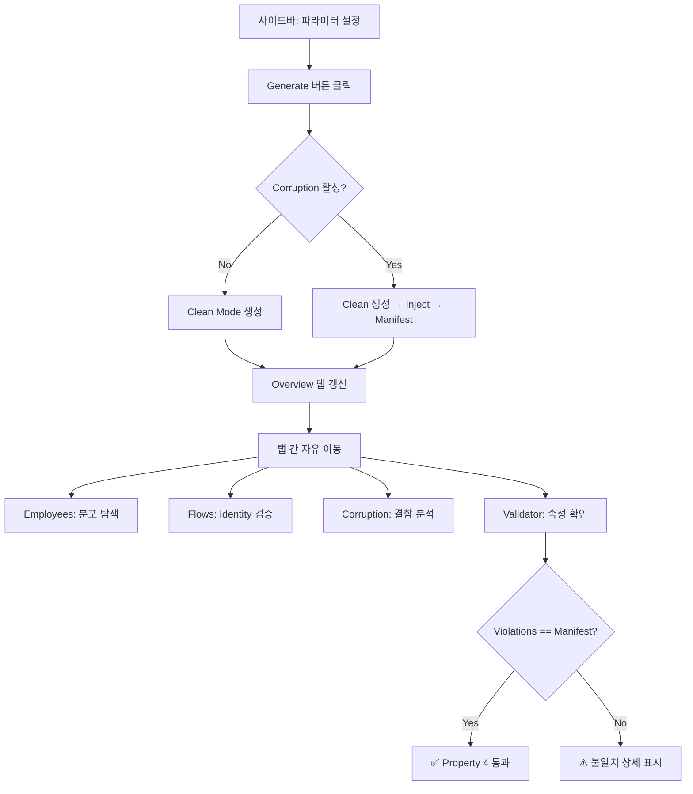

# Streamlit 탐색 대시보드 — UI 목업

> 이 문서는 `synthetic-hr-generator`로 생성한 데이터셋을 탐색하는 Streamlit 앱의 와이어프레임입니다.
> 실제 구현은 생성기 완성 후 진행됩니다.

---

## 전체 레이아웃

```
┌─────────────────────────────────────────────────────────────────────────────┐
│  🏢 HR Analytics — Synthetic Data Explorer                          [Dark] │
├────────────────┬────────────────────────────────────────────────────────────┤
│                │                                                            │
│  ◀ SIDEBAR     │              MAIN CONTENT AREA                            │
│                │                                                            │
│  ┌──────────┐  │  Tabs: [📊 Overview] [👥 Employees] [📈 Flows]           │
│  │ GENERATE │  │        [🔧 Corruption] [✅ Validator]                     │
│  └──────────┘  │                                                            │
│                │                                                            │
│  ─── Config ── │                                                            │
│  Headcount:    │                                                            │
│  [    100   ]  │                                                            │
│                │                                                            │
│  Job Levels:   │                                                            │
│  [     5    ]  │                                                            │
│                │                                                            │
│  Departments:  │                                                            │
│  [     8    ]  │                                                            │
│                │                                                            │
│  Date Range:   │                                                            │
│  [2022-01-01]  │                                                            │
│  [2023-12-31]  │                                                            │
│                │                                                            │
│  Seed:         │                                                            │
│  [  42      ]  │                                                            │
│                │                                                            │
│  ─── Rates ─── │                                                            │
│  Hire Rate:    │                                                            │
│  ──●────── 0.15│                                                            │
│                │                                                            │
│  Sep Rate:     │                                                            │
│  ────●──── 0.12│                                                            │
│                │                                                            │
│  Vol. Share:   │                                                            │
│  ──────●── 0.65│                                                            │
│                │                                                            │
│  Promotion:    │                                                            │
│  ─●──────── 0.08│                                                           │
│                │                                                            │
│  ─ Corruption ─│                                                            │
│  ☐ Enable      │                                                            │
│                │                                                            │
│  NULL_INJ: 0.05│                                                            │
│  DUP_KEY: 0.03 │                                                            │
│  ORPHAN:  0.04 │                                                            │
│  DATE_C:  0.02 │                                                            │
│  RANGE:   0.06 │                                                            │
│                │                                                            │
│  ─── Output ── │                                                            │
│  💾 Save CSV   │                                                            │
│  💾 Save Parq. │                                                            │
│                │                                                            │
└────────────────┴────────────────────────────────────────────────────────────┘
```

---

## Tab 1: 📊 Overview

```
┌─────────────────────────────────────────────────────────────────────┐
│  📊 Dataset Overview                                                │
├─────────────────────────────────────────────────────────────────────┤
│                                                                     │
│  ┌─────────────┐ ┌─────────────┐ ┌─────────────┐ ┌─────────────┐  │
│  │   Employees │ │    Events   │ │ Assignments │ │   Reviews   │  │
│  │     247     │ │     389     │ │     412     │ │     186     │  │
│  │  ↑12% vs   │ │  ↑8% vs     │ │             │ │             │  │
│  │  initial    │ │  initial    │ │             │ │             │  │
│  └─────────────┘ └─────────────┘ └─────────────┘ └─────────────┘  │
│                                                                     │
│  Run Metadata                                                       │
│  ┌─────────────────────────────────────────────────────────────┐   │
│  │ Seed: 42 │ Schema v1 │ Currency: USD │ Periods: 24 (Monthly)│   │
│  │ Mode: Clean │ Generated: 2026-08-20T14:32:01                │   │
│  └─────────────────────────────────────────────────────────────┘   │
│                                                                     │
│  Schema Summary                                                     │
│  ┌──────────────────────┬───────┬──────────┬───────────────────┐   │
│  │ Table                │ Rows  │ Columns  │ Nulls (expected)  │   │
│  ├──────────────────────┼───────┼──────────┼───────────────────┤   │
│  │ departments          │     8 │        3 │ —                 │   │
│  │ employees            │   247 │        6 │ separation: 38    │   │
│  │ employment_events    │   389 │        8 │ from/to cols: var │   │
│  │ assignments          │   412 │        6 │ end_date: 209     │   │
│  │ compensation         │   389 │        5 │ —                 │   │
│  │ performance_reviews  │   186 │        7 │ reviewer: 12      │   │
│  │ org_periods          │   720 │       10 │ —                 │   │
│  └──────────────────────┴───────┴──────────┴───────────────────┘   │
│                                                                     │
└─────────────────────────────────────────────────────────────────────┘
```

---

## Tab 2: 👥 Employees

```
┌─────────────────────────────────────────────────────────────────────┐
│  👥 Employee Explorer                                               │
├─────────────────────────────────────────────────────────────────────┤
│                                                                     │
│  Filter: [Department ▼] [Job Level ▼] [Status: All ▼]              │
│                                                                     │
│  ┌─ Headcount Over Time ────────────────────────────────────────┐  │
│  │  260┤                                                         │  │
│  │     │         ╭──╮                                            │  │
│  │  240┤    ╭───╯    ╰──╮        ╭──╮                           │  │
│  │     │   ╯             ╰──╮  ╭╯    ╰───╮                     │  │
│  │  220┤                     ╰─╯          ╰──╮    ╭──╮          │  │
│  │     │                                      ╰──╯    ╰──       │  │
│  │  200┤╮                                                        │  │
│  │     ├──────┬──────┬──────┬──────┬──────┬──────┬──────┬─────  │  │
│  │     2022-01 2022-04 2022-07 2022-10 2023-01 2023-04 2023-07  │  │
│  └───────────────────────────────────────────────────────────────┘  │
│                                                                     │
│  ┌─ Tenure Distribution ───────┐  ┌─ Level Distribution ────────┐  │
│  │  ██████████████  0-6mo: 42  │  │  Level 1: ████████████  78  │  │
│  │  ████████████    6-12mo: 36 │  │  Level 2: ██████████    62  │  │
│  │  ██████████      1-2yr: 58  │  │  Level 3: ████████      48  │  │
│  │  ████████        2-3yr: 45  │  │  Level 4: █████         35  │  │
│  │  ████            3-5yr: 38  │  │  Level 5: ███           24  │  │
│  │  ██              5yr+:  28  │  │                              │  │
│  └──────────────────────────────┘  └──────────────────────────────┘  │
│                                                                     │
│  ┌─ Employee Detail Table (paginated) ──────────────────────────┐  │
│  │ ID        │ Hire Date  │ Sep Date   │ Level │ Dept    │Status│  │
│  │ EMP-0001  │ 2020-03-15 │ —          │  3    │ DEPT_01 │ ● Active│
│  │ EMP-0002  │ 2019-11-22 │ 2022-08-14 │  2    │ DEPT_03 │ ○ Sep  │
│  │ EMP-0003  │ 2021-06-01 │ —          │  4    │ DEPT_01 │ ● Active│
│  │ EMP-0004  │ 2022-02-10 │ 2022-09-30 │  1    │ DEPT_05 │ ○ Sep  │
│  │ ...       │            │            │       │         │       │  │
│  └───────────────────────────────────────────── [1/13] ──────────┘  │
│                                                                     │
└─────────────────────────────────────────────────────────────────────┘
```

---

## Tab 3: 📈 Flows (Flow Identity 검증)

```
┌─────────────────────────────────────────────────────────────────────┐
│  📈 Headcount Flows & Flow Identity                                 │
├─────────────────────────────────────────────────────────────────────┤
│                                                                     │
│  Grain: (● ORG) (○ DEPARTMENT) (○ LEVEL)                           │
│  Department: [All ▼]  (disabled when grain = ORG)                  │
│                                                                     │
│  ┌─ Flow Waterfall ─────────────────────────────────────────────┐  │
│  │                                                               │  │
│  │  Period: 2022-06                                              │  │
│  │                                                               │  │
│  │  Opening    +Hires   +Transf In  -Seps   -Transf Out  Closing│  │
│  │                                                               │  │
│  │  ┌────┐                                                       │  │
│  │  │ 218│   ┌──┐                                   ┌────┐      │  │
│  │  │    │   │+5│    ┌──┐      ┌──┐    ┌──┐        │ 220│      │  │
│  │  │    │   │  │    │+3│      │-4│    │-2│        │    │      │  │
│  │  │    │   │  │    │  │      │  │    │  │        │    │      │  │
│  │  └────┘   └──┘    └──┘      └──┘    └──┘        └────┘      │  │
│  │                                                               │  │
│  │  ✅ Flow Identity: 218 + 5 + 3 - 4 - 2 = 220 ✓              │  │
│  └───────────────────────────────────────────────────────────────┘  │
│                                                                     │
│  ┌─ All Periods Summary ────────────────────────────────────────┐  │
│  │ Period   │Open │Hire│TrIn│ Sep │TrOut│Close│ Identity │Status│  │
│  │ 2022-01  │ 100 │  4 │  0 │   2 │   0 │ 102 │ 100+4-2  │ ✅  │  │
│  │ 2022-02  │ 102 │  3 │  0 │   1 │   0 │ 104 │ 102+3-1  │ ✅  │  │
│  │ 2022-03  │ 104 │  5 │  0 │   3 │   0 │ 106 │ 104+5-3  │ ✅  │  │
│  │ ...      │     │    │    │     │     │     │          │     │  │
│  │ 2023-12  │ 218 │  2 │  0 │   4 │   0 │ 216 │ 218+2-4  │ ✅  │  │
│  └──────────────────────────── All periods: ✅ PASS ─────────────┘  │
│                                                                     │
│  ┌─ Cross-Grain Consistency ────────────────────────────────────┐  │
│  │  Period 2022-06:                                              │  │
│  │  Org closing (220) = Σ Dept closings (220) ✅                 │  │
│  │  Org closing (220) = Σ Level closings (220) ✅                │  │
│  └───────────────────────────────────────────────────────────────┘  │
│                                                                     │
└─────────────────────────────────────────────────────────────────────┘
```

---

## Tab 4: 🔧 Corruption (Defect Injection 탐색)

```
┌─────────────────────────────────────────────────────────────────────┐
│  🔧 Corruption Mode — Defect Injection Analysis                     │
├─────────────────────────────────────────────────────────────────────┤
│                                                                     │
│  ⚠️  Corruption mode is ENABLED                                     │
│                                                                     │
│  ┌─ Injection Summary ──────────────────────────────────────────┐  │
│  │ Defect Type           │ Rate │ Eligible │ Target │ Achieved │Skip│
│  │ NULL_INJECTION        │ 0.05 │   1,842  │    92  │      92  │  0│
│  │ DUPLICATE_KEY         │ 0.03 │     247  │     7  │       7  │  0│
│  │ ORPHAN_FK             │ 0.04 │     638  │    26  │      26  │  0│
│  │ DATE_CONTRADICTION    │ 0.02 │     412  │     8  │       8  │  0│
│  │ VALUE_OUT_OF_RANGE    │ 0.06 │     433  │    26  │      26  │  0│
│  ├───────────────────────────────────────────────────────────────┤  │
│  │ TOTAL DEFECTS INJECTED: 159                                   │  │
│  └───────────────────────────────────────────────────────────────┘  │
│                                                                     │
│  ┌─ Defect Distribution (Pie) ─┐  ┌─ Defect by Table (Bar) ────┐  │
│  │                              │  │                             │  │
│  │       ╭───╮                  │  │ employees     ████████ 34  │  │
│  │     ╭╯NULL╰╮                │  │ events        ██████   22  │  │
│  │    ╭╯ 58%   ╰╮              │  │ assignments   █████    19  │  │
│  │    │           │             │  │ compensation  ██████   24  │  │
│  │    ╰╮         ╭╯            │  │ performance   █████    20  │  │
│  │     ╰╮RANGE16%╭╯            │  │ org_periods   ████████ 40  │  │
│  │       ╰─┬─┬─╯              │  │                             │  │
│  │  DUP:4% FK:16% DATE:5%     │  │                             │  │
│  └──────────────────────────────┘  └─────────────────────────────┘  │
│                                                                     │
│  ┌─ Defect Manifest (searchable, sortable) ─────────────────────┐  │
│  │ 🔍 [Search by table, type, column...]                         │  │
│  │                                                               │  │
│  │ Table     │ Row  │ Column        │ Type              │Orig→Mut│  │
│  │ employees │   23 │ hire_date     │ NULL_INJECTION    │2022→None│  │
│  │ employees │   89 │ employee_id   │ DUPLICATE_KEY     │→EMP-023│  │
│  │ assign    │  156 │ department_id │ ORPHAN_FK         │D01→xyz │  │
│  │ assign    │  342 │ start/end     │ DATE_CONTRADICTION│swap    │  │
│  │ comp      │   45 │ annual_salary │ VALUE_OUT_OF_RANGE│50k→5M  │  │
│  │ ...                                                           │  │
│  └───────────────────────────────────────────── [1/8 pages] ─────┘  │
│                                                                     │
│  ┌─ Clean vs Corrupted Diff Viewer ─────────────────────────────┐  │
│  │ Select record: [employees row 23 ▼]                           │  │
│  │                                                               │  │
│  │  CLEAN                          CORRUPTED                     │  │
│  │  ┌────────────────────┐         ┌────────────────────┐       │  │
│  │  │ employee_id: EMP-23│         │ employee_id: EMP-23│       │  │
│  │  │ hire_date: 2022-03 │         │ hire_date: ■ NULL ■│ ← ⚠️ │  │
│  │  │ separation: —      │         │ separation: —      │       │  │
│  │  │ level: 2           │         │ level: 2           │       │  │
│  │  └────────────────────┘         └────────────────────┘       │  │
│  └───────────────────────────────────────────────────────────────┘  │
│                                                                     │
└─────────────────────────────────────────────────────────────────────┘
```

---

## Tab 5: ✅ Validator (실시간 검증)

```
┌─────────────────────────────────────────────────────────────────────┐
│  ✅ Validator — Schema & Invariant Check                            │
├─────────────────────────────────────────────────────────────────────┤
│                                                                     │
│  [▶ Run Validator]                                                  │
│                                                                     │
│  ┌─ Validation Result ──────────────────────────────────────────┐  │
│  │                                                               │  │
│  │  Mode: Corruption  │  Violations Found: 159  │  Time: 0.23s  │  │
│  │                                                               │  │
│  └───────────────────────────────────────────────────────────────┘  │
│                                                                     │
│  ┌─ Manifest vs Validator Comparison ───────────────────────────┐  │
│  │                                                               │  │
│  │  Manifest defects:    159                                     │  │
│  │  Validator violations: 159                                    │  │
│  │                                                               │  │
│  │  ┌──────────────────────────────────────────────────────┐    │  │
│  │  │         Manifest          │        Validator         │    │  │
│  │  │                           │                          │    │  │
│  │  │     ╭─────────────────╮   │                          │    │  │
│  │  │     │                 │   │                          │    │  │
│  │  │     │    159 items    │ = │     159 items            │    │  │
│  │  │     │   EXACT MATCH   │   │                          │    │  │
│  │  │     │                 │   │                          │    │  │
│  │  │     ╰─────────────────╯   │                          │    │  │
│  │  │                           │                          │    │  │
│  │  │  Missing from validator: 0│  Extra in validator: 0   │    │  │
│  │  └──────────────────────────────────────────────────────┘    │  │
│  │                                                               │  │
│  │  ✅ Property 4 SATISFIED: violations == manifest              │  │
│  │                                                               │  │
│  └───────────────────────────────────────────────────────────────┘  │
│                                                                     │
│  ┌─ Violation Breakdown ────────────────────────────────────────┐  │
│  │                                                               │  │
│  │  Check Type              │ Violations │ Status               │  │
│  │  Non-nullable fields     │     92     │ matches manifest ✅  │  │
│  │  PK uniqueness           │      7     │ matches manifest ✅  │  │
│  │  FK referential          │     26     │ matches manifest ✅  │  │
│  │  Temporal ordering       │      8     │ matches manifest ✅  │  │
│  │  Value boundaries        │     26     │ matches manifest ✅  │  │
│  │  Interval continuity     │      0     │ no violations    ✅  │  │
│  │                                                               │  │
│  └───────────────────────────────────────────────────────────────┘  │
│                                                                     │
│  ┌─ Clean Mode Quick Check ─────────────────────────────────────┐  │
│  │  ℹ️  Re-generate with all corruption rates = 0 to verify      │  │
│  │      the clean-mode invariant (Property 3).                   │  │
│  │                                                               │  │
│  │  [▶ Generate Clean & Validate]                                │  │
│  │                                                               │  │
│  │  Result: ✅ 0 violations — Clean mode invariant holds         │  │
│  └───────────────────────────────────────────────────────────────┘  │
│                                                                     │
└─────────────────────────────────────────────────────────────────────┘
```

---

## 인터랙션 흐름



---

## 기술 노트

| 항목 | 설계 결정 |
|------|-----------|
| 프레임워크 | Streamlit |
| 데이터 로딩 | `generate()` 호출 → in-memory `GeneratedDataset` 직접 사용 |
| 캐싱 | `@st.cache_data` on `generate()` — seed+config가 key |
| 파일 저장 | Serializer의 `to_csv()` 호출, 임시 디렉토리에 저장 후 다운로드 |
| 반응성 | 파라미터 변경 시 자동 재생성하지 않음 — Generate 버튼으로만 트리거 |
| 네트워크 | 제로. 모든 연산은 로컬 |
| Parquet | pyarrow 승인 시에만 Save Parquet 버튼 활성화 |

---

## 비목표 (이 대시보드에서 하지 않는 것)

- 지표(metric) 계산 — 별도 앱 또는 별도 탭으로 추후 확장
- 다중 사용자 동시 접근
- 실데이터 업로드/분석
- 인증/권한 관리
